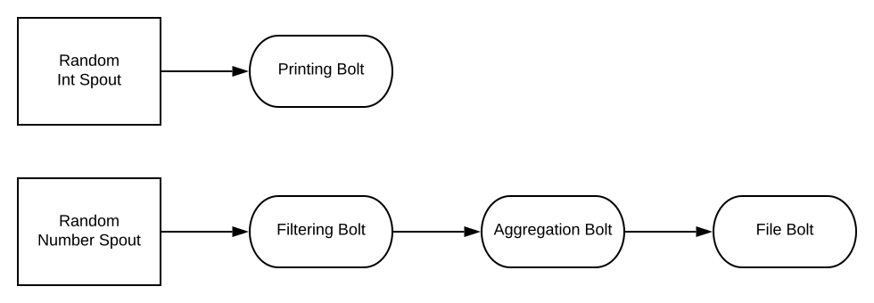

# Datamanagement "Distributed Data Structures"

## Einführung
Komplexe und aufteilbare Tasks müssen mit Parametern ausgestattet werden und von
entsprechenden Koordinatoren gestartet bzw. die erhaltenen Daten wieder zusammengefasst
werden. Diese Art von verteilter Programmierung findet in vielen Anwendungsgebieten rege
Verwendung (AI Daten Analyse, Lastverteilung, etc.). Hierbei kommt das Prinzip des
Master/Worker Patterns (Master-Slave oder Map-Reduce Pattern) zum Einsatz.

## Ziele
Finden Sie eine Lösung, die in einer Cloud-Umgebung ausrollbar (deployable) ist. Die einzelnen
Worker sollen unabhängig voneinander bestehen können und mit Input-Parametern gestartet
werden. Die berechneten Daten müssen an den Master bzw. als Zwischenberechnung an andere
Worker weitergegeben werden können. Die einzelnen Worker sollen unabhängig von der
Umgebung gestartet werden können (unterschiedliche Servereinheiten).

## Vorausetzung
* Grundverständnis von Python oder Java
* Lesen und Umsetzen von APIs
* Fähigkeit komplexe Programmier-Aufgaben zu implementieren und zu verteilen

## Vergleich

Ich habe die Frameworks Atomix und Apache Storm verglichen.

Atomix verbindet mehrere Hosts miteinander ohne klare Struktur. Diese Hosts sind Unabhängig voneinander. Es wird vor allem ein Ansatz von Publish and Subscribe oder auch Broadcast. Dies passiert auf unterschiedlichen Topics um die kommunikation voneinander zu trennen.

Apache Storm ist dafür gedacht viele Daten in Realtime zu verarbeiten. Es kann bis zu eine Millionen Tupel pro Sekunde pro Node verarbeiten. Diese Daten sind festgeschrieben wie sie verarbeitet werden (Von welchem Sprout zu welchen Bolt). Und hat daher eine stark vorgeschrieben Struktur und Aufbau.

## Implementierung
### Atmoix

Um eine Node zu definieren braucht man eine Adresse und eine ID.

```java
String masterId = "master";
Address masterAddress = new Address("localhost", 18000);
Node master = Node.builder()
    .withId(masterId)
    .withAddress(masterAddress)
    .build();
```

Um eine Atomix Instanz zu konfigurieren braucht man einen `AtomixBuilder`

```java
AtomixBuilder builder = Atomix.builder();
```

Diesen kann man dann konfigurieren mit der ID und der Adresse

```java
builder.withMemberId(StaticVars.masterId)
    .withAddress(StaticVars.masterAddress)
    .build();
```

Danach definiert man welche anderen Nodes für den Cluster gebraucht werden

```java
builder.withMembershipProvider(BootstrapDiscoveryProvider.builder()
    .withNodes(StaticVars.master, StaticVars.client1, StaticVars.client2)
    .build());
```

Warten bis der Cluster geformt wurde:

```java
Atomix atomix = builder.build();
    atomix.start().join();
```

Auf dem Master frage ich jede Sekunde nach der Nächst höheren Fibonacci Nummer.
Ein `AtomicInteger` wird verwendet um ihn in der Lambda Ausdruck zu verwenden.
Im `send` Befehl geben wir ein Topic und einen Wert. Der Wert gibt an welche Fibonacci Nummer berechnet werden soll. 

```java
AtomicInteger i = new AtomicInteger();
while (true) {
    atomix.getEventService().send(StaticVars.topicFibonacci, i.get()).thenAccept(response -> {
        System.out.println("Fib " + i.getAndIncrement() + ": " + response);
    });
    Thread.sleep(1000);
}
```

Der Client meldet sich an anfragen über diese Topic zu bearbeiten.

```java
atomix.getEventService().subscribe(
    StaticVars.topicFibonacci,
    message -> {
        System.out.println("Client" + client + ": " + message);
        return CompletableFuture.completedFuture(fibonacci((Integer) message));
    }
);
```

### Ergebnisse

Master

```
Fib 0: 0
Fib 1: 1
Fib 2: 1
Fib 3: 2
Fib 4: 3
Fib 5: 5
Fib 6: 8
Fib 7: 13
Fib 8: 21
Fib 9: 34
Fib 10: 55
Fib 11: 89
```

Client 1:

```
Client1: 0
Client1: 1
Client1: 2
Client1: 4
Client1: 6
Client1: 8
Client1: 10
```

Client 2:

```
Client2: 3
Client2: 5
Client2: 7
Client2: 9
Client2: 11
```

Hier kann man sehen das eine Aufgabe eine Fibonacci Nummer zu finden einem Client zugeteilt wird. Man sieht außerdem, dass der zweite Client am Anfang noch nicht gestartet war und deswegen die ersten drei Aufgaben an Client 1 gesendet wurden.

### Storm

Storm verwendet einen Fluss an Tuples. Ein "Tuple" ist eine Liste an benannten Werten.

Storm verwendet "Spout", "Bolt" und "Topology". Ein "Spout" ist eine Datenquelle. Ein "Bolt" nimmt eine Anzahl von Inputs und generiert eine Anzahl an Outputs. Die "Toplogoy" beschreibt die Topologie des Netzwerkes und wie die unterschiedlichen "Spouts" und "Bolts" miteinander verbunden sind.

Die Topologie unseres Netzwerkes schaut wie folgt aus.



Unserer `RandomNumberSpout` wird mit `open` initialisiert. In `nextTouple` wird das nächste Tuple abgefragt. In dieser integrieren wir ein künstliches warten um Abfragezeiten zu simulieren. `declareOutputFields` werden die Namen der Werte vom Tupel gesetzt. `RandomIntSpout` ist ziemlich der selbe Code nur das die zufälligen Nummern kleiner sind und der Output Name `randomInt` ist.

```java
public class RandomNumberSpout extends BaseRichSpout {
    private Random random;
    private SpoutOutputCollector outputCollector;

    @Override
    public void open(Map<String, Object> conf, TopologyContext context, SpoutOutputCollector collector) {
        random = new Random();
        outputCollector = collector;
    }

    @Override
    public void nextTuple() {
        Utils.sleep(1000);
        int operation = random.nextInt(100);
        long timestamp = System.currentTimeMillis();
        
        Values values = new Values(operation, timestamp);
        outputCollector.emit(values);
    }

    @Override
    public void declareOutputFields(OutputFieldsDeclarer declarer) {
        declarer.declare(new Fields("operation", "timestamp"));
    }
}

```

Die Klasse `FilteringBolt` filtert alle Tuples wo die Operation 0 ist. Die anderen werden unverändert weitergeleitet.

```java
public class FilteringBolt extends BaseBasicBolt {
    @Override
    public void execute(Tuple input, BasicOutputCollector collector) {
        int operation = input.getIntegerByField("operation");
        if(operation > 0) {
            collector.emit(input.getValues());
        }
    }

    @Override
    public void declareOutputFields(OutputFieldsDeclarer declarer) {
        declarer.declare(new Fields("operation", "timestamp"));
    }
}
```

Im `AggregationBolt` aggregieren wir die Summe der zufälligen Werte von dem `FilterBolt`. Hierbei bekommen wir ein `TupleWindow`. Wie groß diese Fenster ist wird über die Topologie festgesetzt.

```java
public class AggregationBolt extends BaseWindowedBolt {
    private OutputCollector collector;
    
    @Override
    public void prepare(Map<String, Object> topoConf, TopologyContext context, OutputCollector collector) {
        this.collector = collector;
    }

    @Override
    public void execute(TupleWindow inputWindow) {
        List<Tuple> tuples = inputWindow.get();
        tuples.sort(Comparator.comparing(this::getTimestamp));
        
        int sumOfOperations = tuples.stream()
                .mapToInt(tuple -> tuple.getIntegerByField("operation"))
                .sum();
        Long beginningTimestamp = getTimestamp(tuples.get(0));
        Long endTimestamp = getTimestamp(tuples.get(tuples.size() - 1));

        Values values = new Values(sumOfOperations, beginningTimestamp, endTimestamp);
        collector.emit(values);
    }

    private Long getTimestamp(Tuple tuple) {
        return tuple.getLongByField("timestamp");
    }
    
    @Override
    public void declareOutputFields(OutputFieldsDeclarer declarer) {
        declarer.declare(new Fields("sumOfOperations", "beginningTimestamp", "endTimestamp"));
    }
}
```

Im `FileWritingBolt` bekommen wir die Daten vom `AggregationBolt` und schreiben diese in eine Datei wenn die Summe größer als 10 ist.

```java
public class FileWritingBolt extends BaseRichBolt {
    public static Logger logger = LoggerFactory.getLogger(FileWritingBolt.class);
    private BufferedWriter writer;
    private String filePath;
    private ObjectMapper objectMapper;

    public FileWritingBolt(String filePath) {
        this.filePath = filePath;
    }

    @Override
    public void cleanup() {
        try {
            writer.close();
        } catch (IOException e) {
            logger.error("Failed to close writer!");
        }
    }

    @Override
    public void prepare(Map<String, Object> topoConf, TopologyContext context, OutputCollector collector) {
        objectMapper = new ObjectMapper();
        objectMapper.setVisibility(PropertyAccessor.FIELD, JsonAutoDetect.Visibility.ANY);

        try {
            writer = new BufferedWriter(new FileWriter(filePath));
        } catch (IOException e) {
            logger.error("Failed to open file for writing!", e);
        }
    }

    @Override
    public void execute(Tuple input) {
        int sumOfOperations = input.getIntegerByField("sumOfOperations");
        long beginningTimestamp = input.getLongByField("beginningTimestamp");
        long endTimestamp = input.getLongByField("endTimestamp");

        if (sumOfOperations > 10) {
            AggregationWindow aggregationWindow = new AggregationWindow(sumOfOperations, beginningTimestamp, endTimestamp);
            try {
                writer.write(objectMapper.writeValueAsString(aggregationWindow));
                writer.newLine();
                writer.flush();
            } catch (IOException e) {
                logger.error("Failed to write data to file.", e);
            }
        }
    }

    @Override
    public void declareOutputFields(OutputFieldsDeclarer declarer) {
        
    }
}
```

Um nun alle diese Spouts und Bolts in eine Topologie zu verbinden verwenden wir einen `TopologyBuilder`. Hier können wir `setSpout` verwenden um ein Datenquelle zu definieren. Wir müssen eine ID und unsere Implementation angeben. Danach können wir mit `setBolt` ein Bolt definieren. Hierbei müssen wir wieder eine ID und unsere Implementation angeben. Außerdem müssen wir mittels `shuffleGrouping` eine Spout oder Bolt definieren von wo Daten weitergeleitet werden. Für die `AggregationBolt` definieren wir welcher Wert der Zeitpunkt ist und über welchen Zeitraum wir die Daten aggregieren.

```java
public class Main {
    public static void main(String[] args) throws Exception {
        TopologyBuilder builder = new TopologyBuilder();

        builder.setSpout("randomIntSpout", new RandomIntSpout());
        builder.setBolt("printBolt", new PrintingBolt()).shuffleGrouping("randomIntSpout");

        builder.setSpout("randomNumberSpout", new RandomNumberSpout());
        builder.setBolt("filteringBolt", new FilteringBolt()).shuffleGrouping("randomNumberSpout");
        builder.setBolt("aggregationBolt", new AggregationBolt()
                .withTimestampField("timestamp")
                .withLag(BaseWindowedBolt.Duration.seconds(1))
                .withWindow(BaseWindowedBolt.Duration.seconds(5))
        ).shuffleGrouping("filteringBolt");

        String filePath = "operations.txt";
        builder.setBolt("fileBolt", new FileWritingBolt(filePath)).shuffleGrouping("aggregationBolt");

        Config config = new Config();
        config.setDebug(false);
        LocalCluster cluster = new LocalCluster();
        cluster.submitTopology("Test", config, builder.createTopology());
    }
}
```

## Quellen

http://storm.apache.org/about/simple-api.html

https://www.baeldung.com/apache-storm

https://atomix.io/docs/latest/user-manual/introduction/what-is-atomix/